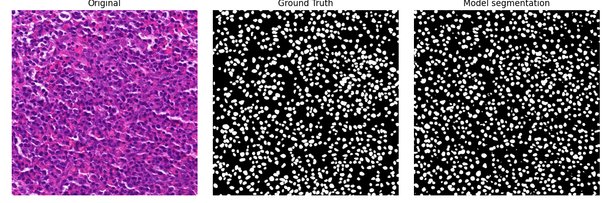

# Histological Image Segmentation and Classification using Neural Networks

This repository contains examples on how to create basic segmentation and classification neural network models using PyTorch.

    

## Index

### Readme

- [Installation](#installation)
- [Tutorials](#tutorials)
  - [Pytorch](#Pytorch)
  - [Neural Networks](#neural-networks)
- [src](#src)
  - [Segmentation](#segmentation)  
  - [Classification](#classification)  
  - [Classification Lymphoma](#classification-lymphoma)  
- [Credits](#credits)  

### Wiki

- [Tutorials](https://github.com/hisokam324/Histological-Image-Segmentation-and-Clasification-using-Neural-Networks/wiki/Tutorials)  
- [src](https://github.com/hisokam324/Histological-Image-Segmentation-and-Clasification-using-Neural-Networks/wiki/src)  

## Installation

To use this code, it is necessary to install the modules listed in `requirements.txt`:

    pip install -r requirements.txt

## Tutorials
This folder contains tutorials to understand how to implement basic neural networks in PyTorch.

### PyTorch
A curated collection of PyTorch tutorials sourced from [Pytorch.org](https://pytorch.org/) and the [PyTorch YouTube channel](https://www.youtube.com/playlist?list=PL_lsbAsL_o2CTlGHgMxNrKhzP97BaG9ZN).
It includes five .ipynb notebooks covering:

    Tensors

    Autograd

    Building Models

    TensorBoard

    Model Training

### Neural Networks
A collection of basic neural network tutorials adapted from [OpenFing — Aprendizaje Profundo para el Análisis de Imágenes Biomédicas](https://open.fing.edu.uy/courses/dlbioim/4/).
It includes five .ipynb notebooks covering:

    Introduction

    Autograd

    MLP

    CNN

    RNN

Additionally, following the pre-existing notebooks, two new notebooks were created:

    Auto – Implementation of an Autoencoder

    UNet – Implementation of a UNet architecture

These additional notebooks were tested using the [Data Science Bowl 2018 dataset](https://www.kaggle.com/competitions/data-science-bowl-2018), which consists of fluorescent microscopy images for segmentation.

## src
This folder contains the results of implementing basic neural networks in PyTorch for histological analysis.

### utils
Auxiliary module for running the main code.

### models
PyTorch model implementations.

### Segmentation
Segmentation training on the [NuInsSeg](https://www.kaggle.com/datasets/ipateam/nuinsseg) dataset.

### Classification
Classification training on the [PathMNIST](https://medmnist.com/) dataset.

### Classification Lymphoma
Segmentation and classification training on the [fe-extern/Lymphoma Dataset](https://git.fh-ooe.at/fe-extern/Lymphoma-Dataset) Dataset.

### Add new folder
- Create "models" folder to save models parameters.
- Create "configuration.json" to set traning parameters, see more [wiki](https://github.com/hisokam324/Histological-Image-Segmentation-and-Clasification-using-Neural-Networks/wiki/src#configuration).
- Create "load.py" to load dataset.
- Create training and test files, using "utils.py" and "load.py" functions.

## Credits

Tutorials adapted from [PyTorch](https://pytorch.org/) and [OpenFing](https://open.fing.edu.uy/courses/dlbioim/4/).

Data provided by [Kaggle](https://www.kaggle.com/), [MedMNIST](https://medmnist.com/) and [fe-extern](https://git.fh-ooe.at/fe-extern).
